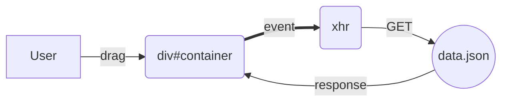

# Drag Scroll

[Vanlina JavaScript 30](https://javascript30.com/)의 27번 토픽을 변형하여 기본적인 Drag, Scroll 이벤트를 숙지하고 node module중 file-system을 이용하여 json파일의 데이터를 이용해 데이터를 불러오는 것을 과제로 삼았다. 


## Flowchart




## Discription

음원정보를 보여주는 간단한 사이트 구축했으며, 이 사이트는 최초 load할때 모든 데이터를 불러오는 것이 아닌 가로로 데이터들이 담겨있는 요소가 하나 존재한다. 이 요소에 스크롤을 끝까지 드래깅했을때를 판단할 수 있는 이벤트리스너를 달아놓았고, 이벤트를 실행되면 추가적인 데이터를 가져와 container요소에 담아두고자 했다. 


#### LocalServer
Vanlina JS의 취지에 맞게 라이브러리를 사용하지 않고 간단한 xhr(XMLHttpRequest constructer)를 클라이언트측 이벤트가 활성화 될때마다 비동기적으로 express로 지정한 localhost 포트에 request를 보내서 data.json의 데이터를 가져오는 방식을 택했다. 

#### Event
가로로 이루어져 고정된 style값을 갖는 요소였기 때문에 offSet을 이용하는데 무리가 있었고, Scroll 프로퍼티는 사용자 환경 window 사이즈에 따라 유동적으로 바뀐다는 특징 때문에 사용에 어려움이 있었다. 

때문에, 기존에 스크롤이 끝나는것을 판단하는 이벤트로 설계했던 부분을 수정하여 사용자가 데이터를 기다리는 시간을 줄이기 위해 드래그를 멈출 때를 판단하여 소수의 데이터를 가져오는 이벤트로 변경했다. 이 이벤트는 setTimeOut, clearTimeout 메소드를 이용하여 scroll이 멈출 때를 판단시키게 만들어졌다.


이벤트마다 불러온 데이터들을 element생성함수를 이용하여 DOM에 appending하여 데이터를 추가하는 방식을 이용하였다. 

#### CSS
div 박스들을 가로로 쌓기 위해 main container 박스에 

```
white-space : nowrap
overflow-x: scroll;
```

CSS 요소들을 넣어서 가로로 지속적으로 쌓여 스크롤을 통해 데이터들을 확인할 수 있도록 제작했다.
